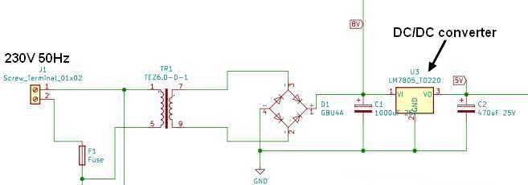

# Solar Pannel Optimizer with WIFI slave SCR




The Goal of this WEB site is to explain why and how I create a Solar Panel Optimzer with a WIFI slave SCR

    First of all I have decided to install solar panel to compensate the energy needed for the simming tool pump.
    
    The pump is a 1.1kW so I install 4 * 250W solar panel on a firewood storage shed roof.

    Due to mains regulation I realized that the excess energy must not be sent to grid. 
    
   IT will be the case in winter (no swimming pool), in spring or autum when the swimming pump is connected only 3 or 4 hours per day.

    May be also in summer when the pump is connected 6 or 7 hours per day.

    In winter the excess energy could be used to heat my workshop in the basement.

    In the other seasons a second small pump with a waterfall and a swimming pool heater could used this excess energy.

    Many thanks to my colleague Xavier, Nabil, Regis

    Please note that it was my first Hardware and Software project since my Ph.D. forty years ago...
    
    ---
# Optimizer description

The issue was the existing electric wiring so I decided to create a Solar Panel Optimizer with a WIFI slave SCR. see my home electric wiring description.

A lot of opimizer exist, commercial one and DIY project. The commercial optimizer are quite expensive and not so efficent. After several weeks reading website and DIY optimizer description I decided to create my own project, and it was quite fun !

 The solar Panel Optimizer is based on a main board ESP32-DEVKITC-32U which is compatible with arduino. The existing DIY project are based on arduino.

 https://mk2pvrouter.co.uk/index.html

 http://ptiwatt.kyna.eu/?post/2018/07/23/Fabriquer-un-power-router

 http://forum-photovoltaique.fr/viewtopic.php?f=18&t=38146
 

 ESP32 module embed a dual core with a dual-core32-bit and a wi-fi link. 
 One core will be used for power calculation, the second core for wi-fi link
 The power calculation is mainly based on ptiwatt router.

---
Hardware description

 A power supply to provide +8V and regulated +5V 

 An optocoupler H11A1 to detect zero cross interruption, a small shift is compensated by software (dimthreshold). the falling edge is hidden by software (first_it_zero_cross)

 Voltage and current measurement using ADC with a shift of 3.3V/2

 the first version of PCB was tested and needs some modifications, the updated version was not tested.
 
 PCB supplier: https://jlcpcb.com/

 BOM supplier: mainly aliexpress, and friends...


Software description

    see comments on source code :-)

Calibration


```c++
float ADC_V_0V = 467 ;
float ADC_I_0A = 467 ;

 //measure shift IT zero cross using software "dim final"  and modify value
```

    measure U and I ADC 0Volt using software "...." and modify values

    float ADC_V_0V = 467 ;
    float ADC_I_0A = 467 ;

    measure shift IT zero cross using software "dim final"  and modify value 

    ==> dimthreshold

    measure mains voltage and modify value

    ==> Vcalibration

    measure mains current using and known power charge and modify value

    ==> Icalibration

    Test the board 
 
Wi-fi

    an UDP link is used to reduce data transfert, only power value is transmitted with an Acknowledge by the client.

    The power value is transmitted each 50msec (byte send_UDP_max); 

    A Time To live is used to check the WiFi activity and restart Wifi link if needed.

    a small M5STACK module can be used as a remote display.

    


